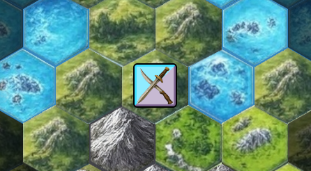
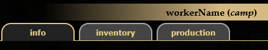
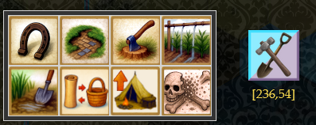
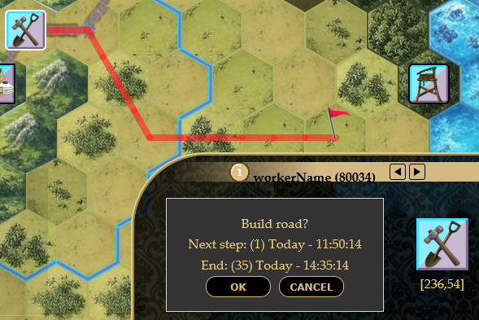

# Unités
----

Les unités sont, avec les villes, le cœur du gameplay, puis qu'elle permettent au joueur d'explorer, de construire, de récolter, de faire la guerre.
## Informations
Pour accéder aux informations d'une unité, _sélectionnez là_ puis cliquez sur l'icône  ou bien utilisez l'un des raccourcis claviers pour accéder directement aux onglets suivants (**si** votre unité dispose d'un tel onglet !) :
 - "**G**" (pour informations **G**énérales)
 - "**I**" (pour **I**nventaire)
 - "**P**" (pour **P**roduction)

## Donner des ordres
Pour donner des ordres à une unité, _sélectionnez là_ puis cliquez sur l'ordre de votre choix. 

Un panneau de confirmation s'affichera. Pour tout les ordre permettant le mouvement, cliquez sur la map directement avec votre _clic gauche_ pour ajouter une étape. Vous pouvez déplacer la map avec le _clic centre_ ou les flèches de votre clavier. Vous validez la dernière étape comme une destination en cliquant sur _OK_.

## Type
Il existe différent type d'unités. Elle sont de différentes catégories :
 - Combat (permettront la guerre, des forts, des tours d'observations etc.)
 - Transport (permettront de déplacer beaucoup d'items)
 - Ouvrière (permettront de modifier le terrain et d'exploiter des ressources)
 - Navale (permettront de transporter des biens et des unités sur les mers, ainsi que d'y apporter la guerre)

## Caractéristiques
Les unités ont des caractéristiques (étonnant non ?):
### Mouvement
#### Actuellement
Les unités ont un score de _déplacement_ de **2 à 4** (Fast=2 / Medium=3 / Slow=4).
Les terrains ont un score de **1 à 5** (Easy=1 / Medium=2 / Medium-Hard=3 / Hard=4 / Very Hard=5).
L'addition du score de l'unité et du score de terrain donne le **nombre de tours** nécessaire au passage à la case suivante. Les **routes** réduisent ce coût de 1. Le score final est compris entre **1 et 12** tours (soit entre 5 minutes et 1 heure avec le TIC de 5 minutes).
#### Dans le futur
 - Les unités pourront être groupées en stack, pour ensuite réaliser un déplacement simultané. Sur le jeu, on autorise une stack de 3 unités maximum.
 - La nuit, tout les ordres de mouvements seront figés, (de 22h00 à 7h00?), même si le jeu fonctionne et est accessible. Cela permet d'éviter la victoire automatique des no-life.
 - Les unités terrestre ne pourront aller sur l'eau, sauf les rivières. Si une unité terrestre est sur une rivière elle ne peut que la quitter. Autrement dit elle n'ont que le droit de traverser les rivières. 
 - Les unités navales ne peuvent aller sur la terre, sauf les villes qui sont considéré comme des ports dès qu'elles sont en bord d’océan ou de rivière. Ce n'est pas très précis, mais cela apportera beaucoup au gameplay.

### Vision
#### Actuellement
Couramment nommé **FOV** ("field of view"), c'est le nombre de cases (rayon) que voit une unité. Il y a un score d'unité, de **1 à 2**, et bonus de terrain, de **0 à 2**.
#### Dans le futur
 - Les zone comme les jungle et les forêt diminuerons le **FOV** mais avec un effet masquant.

### Moral
C'est l'équivalent de la vie des unités. échelle de 0 à 100. Lorsque l'unité tombe à 0 elle disparait.
#### Dans le futur
##### Pertes
 - les unités devront embarquer de la nourriture sous peine de perdre du moral, mais pas au point de se dissoudre (max -50%) (car elle peuvent se nourrir sur le terrain - elles font la gueules et mangent mal)
 - Dans le désert (sauf irrigation) ou la banquise : -1pt par **entrée sur la case**, et encore -1pt **par tour** si l'unité n'est pas en mouvement. Rester statique sur une case de désert ou de banquise tue en 8h _IRL_ environ
 - Trêve nocturne en terrain hostile (territoire appartenant à qqn en guerre avec nous) : -10 points au moment de la trêve (ça psychote)

##### Gains
 - Moral entre 1 et 50 : 
	 - +1pt/tour partout sauf en banquise ou désert
 - Moral entre 50 et 100 : 
	 - +1pt/tour si nourriture dans l'inventaire, ou dans une ville qui a de la nourriture en stock
		 - entre 1 et 10 unités de nourriture consommée / tour suivant le type d'unité (échelle : 1000hab=100 nourriture) à réfléchir
 - Première victoire du jour = +25 moral (cap 100) (à voir, si c'est facile à mettre en place ou non)

## Combat
### Dans le futur
Les principes de combat sont assez simples. Les unités ont des scores d'attaque et de défense, les terrains ont un score de combat. Le calcul devient :
	(Score Attaque + Score terrain) - (Score Defense + Score terrain) = Resultat
Les Attaque/Defense vont de 1 à 5, les bonus du terrain, de -1 à 2. Il peut y avoir des bonus de fortification en cas de combat depuis une ville ou un fortin (+1 à +3 max en fonction du niveau)
Donc en théorie un Résultat peut être de -10 à +10.
Un résultat positif signifie une attaque réussie, et le défenseur perd (Résultat)x10 moral.
Un résultat négatif signifie une attaque échouée, et l'attaquant perd (Résultat)x10 moral.
Le moral de base est 100. Une unité peux mourir en un combat dans les cas extrêmes.
## Inventaire
Les unités disposent d'un **inventaire** avec une place exprimée en slots, et va de **0 à 8** slots. Lorsqu'elle meurent, elles laissent sur place un loot, qui se degrade avec le temps **(-1 item/tour**).
## Campement
La plupart des unités ont un ordre "camper"/"fortifier" etc. en fonction de l'unité, permettant de la l'installer sur place et d'activer quelque chose de spécial comme camp de mineur, tour d'observation, camp fortifié, etc.
Ce faisant (sauf pour les tour d'observation) l'unité **conquiert le territoire** immédiatement adjacent. 
## Look
### Dans le futur
Il y aura des icones sur les unités pour repérer ce qu'elles sont en train de faire et si elles sont ennemies ou non, etc.
## Prérequis
Certaines unités ont des bâtiments (Cf [Villes](Villes.md)) spécifique en prérequis.
## Listing
Lister ici les unités possible du jeu
