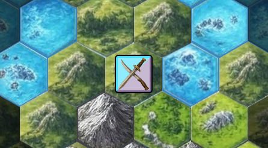
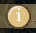
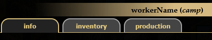
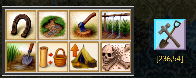
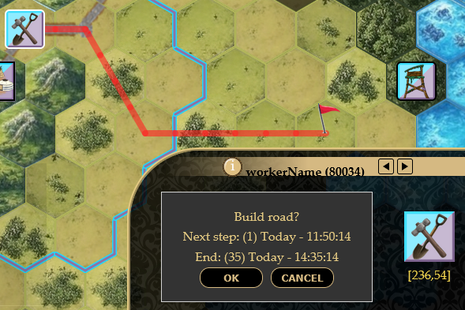

# Unités
----

Les unités sont, avec les villes, le cœur du gameplay, puisqu'elles permettent au joueur d'explorer, de construire, de récolter, de faire la guerre.

## Informations
Pour accéder aux informations d'une unité, _sélectionnez-la_ puis cliquez sur l'icône  ou bien utilisez l'un des raccourcis claviers pour accéder directement aux onglets suivants (**si** votre unité dispose d'un tel onglet !) :
 - "**G**" (pour informations **G**énérales)
 - "**I**" (pour **I**nventaire)
 - "**P**" (pour **P**roduction)

## Donner des ordres
Pour donner des ordres à une unité, _sélectionnez-la_ puis cliquez sur l'ordre de votre choix. 

Un panneau de confirmation s'affichera. Pour tous les ordres permettant le mouvement, cliquez sur la map directement avec votre _clic gauche_ pour ajouter une étape. Vous pouvez déplacer la map avec le _clic centre_ ou les flèches de votre clavier. Vous validez la dernière étape comme une destination en cliquant sur _OK_.

Certains ordres permettent d'**aménager le terrain** (Cf. [Monde](Monde.md))

## Types d'unités
Il existe différents types d'unités, classés en catégories :
 - **Combat** : unités militaires pour la guerre, forts, tours d'observation
 - **Transport** : unités avec un grand inventaire pour déplacer des ressources
 - **Ouvrières** : fermiers, bûcherons, mineurs — modifient le terrain et exploitent des ressources
 - **Navales** : transportent des biens et des unités sur les mers, apportent la guerre sur l'eau
 - **Espionnage** : infiltrations de villes ennemies

## Caractéristiques
Les unités ont des caractéristiques :
### Mouvement
#### Actuellement
Les unités ont un score de _déplacement_ de **2 à 4** (Fast=2 / Medium=3 / Slow=4).
Les terrains ont un score de **1 à 5** (Easy=1 / Medium=2 / Medium-Hard=3 / Hard=4 / Very Hard=5).
L'addition du score de l'unité et du score de terrain donne le **nombre de tours** nécessaire au passage à la case suivante. Les **routes** réduisent ce coût de 1. Le score final est compris entre **1 et 12** tours (soit entre 5 minutes et 1 heure avec le TIC de 5 minutes).
#### À faire
 - La nuit, tous les ordres de mouvements seront figés (de 22h00 à 7h00?), même si le jeu fonctionne et est accessible. Cela permet d'éviter la victoire automatique des no-life.
 - Les unités navales ne peuvent aller sur la terre, sauf les villes qui sont considérées comme des ports dès qu'elles sont en bord d'océan ou de rivière.

### Vision
#### Actuellement
Couramment nommé **FOV** ("field of view"), c'est le nombre de cases (rayon) que voit une unité. Il y a un score d'unité, de **1 à 2**, et un bonus de terrain, de **0 à 2**.

### Moral
C'est l'équivalent de la vie des unités, sur une échelle de 0 à 100. Lorsque l'unité tombe à 0, elle disparaît.
#### Actuellement
 - Les unités consomment de la nourriture pour maintenir leur moral. Sans nourriture, le moral baisse.
 - Dans le désert ou la banquise : -1pt par tour si l'unité n'est pas en mouvement
 - 0 moral = destruction de l'unité
#### À faire
 - Trêve nocturne en terrain hostile : -10 points au moment de la trêve
 - Première victoire du jour = +25 moral (cap 100)

## Zone de contrôle (ZoC)
Cf. [Zone de contrôle](Zone%20de%20Controle.md)

## Conquête de territoires
Cf. [Conquête de territoires](Conquete%20de%20Territoires.md)

## Combat
### Actuellement
Le combat utilise les scores d'attaque et de défense des unités, combinés aux bonus du terrain et au moral. Le calcul prend en compte :
 - Bonus de terrain (défensif ou offensif)
 - Score d'attaque ou de défense de l'unité
 - Aléatoire (-50% à +50%)
 - Moral de l'unité (multiplicateur)
 - Bonus de fortification (si combat depuis une ville ou un fort)

Les combats génèrent des rapports détaillés envoyés aux deux joueurs. Les unités perdantes peuvent tenter de battre en retraite. Si une ville n'est pas défendue par d'unités militaires, elle peut être capturée directement.

## Inventaire
Les unités disposent d'un **inventaire** avec un nombre de slots qui va de **0 à 8+** selon le type. Lorsqu'elles meurent, elles laissent sur place un **loot** qui se dégrade avec le temps **(-1 item/tour)**.

## Campement
La plupart des unités civiles ont un ordre de "camper"/"fortifier" qui les transforme en structures statiques : camp de fermier, camp de bûcheron, camp de mineur, fort en bois, etc.
Ce faisant (sauf pour les tours d'observation) l'unité **conquiert le territoire** immédiatement adjacent. 

## Espionnage
Le système d'espionnage permet d'infiltrer une ville ennemie pour obtenir des informations secrètes sur celle-ci.

#### Espion
L'unité **espion** est une unité spéciale qui se déplace secrètement sur la carte. Elle est invisible aux autres joueurs et peut se déplacer librement dans les territoires ennemis.

L'infiltration se fait via l'ordre **MORPH** lorsque l'espion est physiquement présent dans une ville ennemie. Il devient alors un **espion infiltré**.

#### Contre-mesures
 - Le propriétaire de la ville ne peut pas voir l'espion infiltré directement
 - Chaque tour, la ville a une chance de détecter l'espion basée sur sa population, la présence militaire et le nombre d'espions infiltrés
 - Si détecté, l'espion infiltré est détruit
 - L'espion peut se dés-infiltrer à tout moment avec l'ordre **MORPH** (retour à l'état espion normal)
 - Si la ville est capturée ou détruite, l'espion infiltré redevient un espion normal

### À faire
 - **Missions d'espionnage** (sabotage, assassinat, vol de ressources)
 - **Réseaux d'espions** (un espion peut gérer plusieurs villes)
 - **Espionnage économique** (voir les ressources, les échanges commerciaux)
