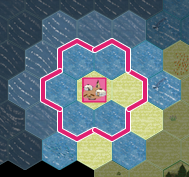

# Villes (WIP)
___

Les villes sont, avec les unités, le cœur du gameplay. Elles permettent de créer des bâtiments, de recruter des unités, de gérer des inventaires importants, et d'exploiter beaucoup de ressources.
## Informations
Pour accéder aux informations d'une ville, _sélectionnez là_ puis cliquez sur l'icône  ou bien utilisez l'un des raccourcis claviers pour accéder directement aux onglets suivants:
 - "**G**" (pour informations **G**énérales)
 - "**I**" (pour **I**nventaire)
 - "**P**" (pour **P**roduction)
 - "**R**" (pour **R**ecrutement)
 - "**B**" (pour **B**âtiments)

## Population
Le plus important pour une ville est sa **population**. Elle croît, décroît, et représente les bras disponible pour réaliser des **bâtiments**, de l'**artisanat**, ou être recruté dans des **unités**.
### Croissance
#### Actuellement
La population évolue en fonction de la **nourriture disponible** et de l'**équilibre des ressources**. Même si l'équilibre est nul, la population peut encore croître légèrement grâce à un mécanisme qui force l'équilibre effectif à 1 lorsque la production est positive. En revanche, sans production alimentaire, la population diminue avec un taux de -2% par tour.

La croissance ralentit naturellement quand la ville devient plus grande, pour refléter les limites d'espace et de ressources. Cette formule utilise une fonction tangente hyperbolique qui réduit progressivement le facteur de croissance à mesure que la population approche 15 000 habitants. Le temps nécessaire pour **doubler** la population est fixé à **16 heures** de jeu (192 tours de 5 minutes).

Ce calcul assure une évolution réaliste et progressive de la population selon les conditions locales, sans croissances trop rapides ou trop brutales. La formule complète de croissance est :

`taux = (équilibre_effectif / production) × (1 / 192) × facteur_population`.

En cas de famine (manque de nourriture en stock), la ville perd **250** habitants par unité de nourriture manquante. Si la population tombe à 499 habitants ou moins, la ville est **abandonnée** et se transforme en unité de **colons**.

#### Dans le futur
À terme, il serait intéressant de mettre en place une mécanique qui lie certains bâtiments et le terrain au moral ou à la santé des habitants, et qui influence la croissance de la population en fonction de ces facteurs.

### Zone d'influence et de production
Les villes définissent l'influence et le territoire des joueurs. Une ville commence avec un territoire d'un rayon de **1** case et peuvent croître jusqu'à un rayon de **3** (pour le moment, cette valeur pourrait évoluer en fonction des retours utilisateurs)
Le joueur "voit" tout ce qui est dans son territoire **+1 case** (zone claire sur l'image). Elle peut également recevoir les bonus de vue de terrain (**1 à 2**).
Lorsqu'une ville dépasse 6.000 habitant, le rayon de cette zone augmente d'une case (=2).
Lorsqu'une ville dépasse 18.000 habitant, le rayon de cette zone augmente d'une case supplémentaire (=3).

### Ohé partisans, ouvriers et paysans…
La population représente une force de travail, par tranche de 1.000 habitants. Par défaut, ils sont affectés à l'**exploitation du terrain**. Donc "paysans". Lorsqu'on les retire de l'exploitation du terrain, ils deviennent disponible pour autre chose, soit :
 - être **recruté** dans une unité (mais ce ne sera pas 1.000 habitants)
 - être **affecté aux terrain**, comme par défaut
 - être **affecté à un bâtiment d'artisanat**, pour produire des ressources secondaires
 - être **affecté à rien du tout**, et vivre leur meilleure vie au frais de la société

A l'avenir, un "_sans affectation_" pourrait aider à augmenter le niveau de joie de la population, en devenant disponible pour faire de la philosophie, de l'art, etc. Mais la mécanique n'est pas clairement définie pour le moment.

## Production
En général un terrain produit entre **1 et 3** unités de ressources d'un ou de plusieurs types. 
1 unité de nourriture nourri 1000 hab. sur 1 TIC.

L’exploitation des cases se fait par **paliers** de **1000** habitants décalés de **500** : entre 0 et 500 habitants, aucune case n’est exploitable ; entre 500 et 1500, 1 case ; entre 1500 et 2500, 2 cases, etc.   Cette méthode simplifie la gestion des seuils et décale l’exploitation des ressources par rapport à la zone d’influence.

Si le terrain a une _Source_ spéciale, il produit **en plus** de sa production normale, la production spéciale. Ces _Sources_ ont un stock de ressource qui s'épuise à la production (Cf. [Ressources](Ressources.md)). 
## Recrutement
a écrire
## Bâtiments
Un bâtiment est créé dans une ville, à l'aide de ressources de base plus ou moins importante et pendant plus ou moins longtemps en fonction de ces ressources. 
Le calcul de base sera "total des ressources additionnée = NB de TIC", dans un premier temps.
Chaque bâtiment construit apportera des points de "culture" (militaire, industrie, commerce), et certain auront des prérequis de points de culture.
La ville a un nombre de "slots" de bâtiments maximum, en fonction de ces habitants (1 slot/1000 hab.).
Donc une ville peut à la fois tout faire, et en même temps, non, car elle ne peux pas faire n'importe quel bâtiment, cela dépend de ce qui a été fait par le passé.
Les bâtiments interdit à la construction devraient ne pas apparaître du tout. Les "autorisés" mais quand on a pas les ressources, devraient être grisés.
Les arbres de bâtiments sont définissable dans les règles du jeu et pourrait donc être différent d'un serveur à l'autre. 
TORO:
- **Liste des Bâtiments** - Tous les bâtiments constructibles
- **Coûts de Construction** - Ressources nécessaires
- **Effets des Bâtiments** - Bonus et capacités

## Inventaire
Au départ, il est de **16** slots, et il est destiné à s'agrandir avec des bâtiments jusqu'à **64** slots au moins. Pour l'avenir il doit inclure un système de destruction d'items.

## Mécaniques de jeu particulières

## Garnison
a écrire

