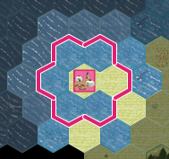

# Villes
___


Les villes sont, avec les unités, le cœur du gameplay. Elles permettent de créer des bâtiments, de recruter des unités, de gérer des inventaires importants, et d'exploiter beaucoup de ressources.

## Informations
Pour accéder aux informations d'une ville, _sélectionnez-la_ puis cliquez sur l'icône  ou bien utilisez l'un des raccourcis claviers pour accéder directement aux onglets suivants :
 - "**G**" (pour informations **G**énérales)
 - "**I**" (pour **I**nventaire)
 - "**P**" (pour **P**roduction)
 - "**R**" (pour **R**ecrutement)
 - "**B**" (pour **B**âtiments)
 - "**C**" (pour **C**raft)


## Population
Le plus important pour une ville est sa **population**. Elle croît, décroît, et représente les bras disponibles pour réaliser des **bâtiments**, de l'**artisanat**, ou être recrutés dans des **unités**.
### Croissance
#### Actuellement
La population évolue en fonction de la **nourriture disponible** et de l'**équilibre des ressources**. 

La croissance est calculée chaque TIC selon un modèle à deux régimes (croissance/décroissance) basé sur une **limite dynamique** déterminée par la production alimentaire et les stocks.

Le calcul :
1. `CONFORT = production_alimentaire × PEOPLE_UNIT`
2. `CONSOMMATION = max(1, population / PEOPLE_UNIT)`
3. `STOCK_TURS = stock_alimentaire / CONSOMMATION`
4. `CONFIANCE = clamp(STOCK_TURS / 288, 0, 2)`
5. `LIMITE_DYNAMIQUE = max(1000, CONFORT) × CONFIANCE`

**Décroissance** (si pop > limite) : `réduction = (pop - limite) × 0.01` (min -1)

**Croissance** (si pop ≤ limite) :
```
ratio_remplissage = pop / limite
frein             = sqrt(1 - ratio_remplissage)
potentiel         = floor(stock_alimentaire × 0.01 × frein)
plafond           = ceil(pop × 0.05)    // max biologique
croissance_finale = min(potentiel, plafond)
```

En cas de famine (manque de nourriture en stock), la ville perd **250** habitants par unité de nourriture manquante. Si la population tombe à 499 habitants ou moins, la ville est **abandonnée** et se transforme en unité de **colons**.

#### À faire
À terme, lier certains bâtiments et le terrain au moral ou à la santé des habitants, pour influencer la croissance de la population.

### Zone d'influence et de production
Les villes définissent l'influence et le territoire des joueurs. Une ville commence avec un territoire d'un rayon de **1** case et peut croître jusqu'à un rayon de **3**.
Le joueur "voit" tout ce qui est dans son territoire **+1 case** (zone claire sur l'image). Elle peut également recevoir les bonus de vue de terrain (**1 à 2**).
Le rayon augmente par paliers de population, chaque palier valant `PEOPLE_UNIT × N` habitants. Les seuils sont définis par une progression quadratique : `PEOPLE_UNIT × n × (n+1)`.
- Rayon 1 : jusqu'à 3 000 hab. `(500 × 6)`
- Rayon 2 : jusqu'à 9 000 hab. `(500 × 18)`
- Rayon 3 : jusqu'à 18 000 hab. `(500 × 36)`

Le rayon est capé par `CITY_MAX_RADIUS` (valeur par défaut : 3).

### Ohé partisans, ouvriers et paysans…
La population représente une force de travail, par tranche de 500 habitants (`PEOPLE_UNIT`). Par défaut, ils sont affectés à l'**exploitation du terrain**. Lorsqu'on les retire de l'exploitation du terrain, ils deviennent disponibles pour autre chose, soit :
 - être **recrutés** dans une unité
 - être **affectés aux terrains**, comme par défaut
 - être **affectés à un bâtiment d'artisanat**, pour produire des ressources secondaires
 - être **affectés aux travaux du bâtiment**, pour créer des bâtiments
 - être **affectés à rien du tout**, et vivre leur meilleure vie au frais de la société

## Production
En général un terrain produit entre **1 et 3** unités de ressources d'un ou de plusieurs types. 
1 unité de nourriture nourrit 1000 hab. sur 1 TIC.

L'exploitation des cases se fait par **tranches** de `PEOPLE_UNIT` (500 habitants) : 1 travailleur par tranche de 500 habitants (`floor(pop / PEOPLE_UNIT)`).

Si le terrain a une _Source_ spéciale, il produit **en plus** de sa production normale, la production spéciale. Ces _Sources_ ont un stock de ressource qui s'épuise à la production (Cf. [Ressources](Ressources.md)).

## Recrutement
Le recrutement se fait via une file d'attente. Chaque unité a un coût en ressources et en population. La ville produit les unités dans l'ordre de la file, automatiquement, tant que les ressources sont disponibles. Si les ressources manquent pour l'unité en tête de file, elle passe à la suivante et remet celle-ci en fin de file.

**Règle de spawn des colons** : Le jeu ne génère un colon automatiquement que si le joueur n'a **aucune ville ET aucun colon** sur la carte.

**Temps de création des colons** : La durée de fabrication d'un colon augmente avec la population totale du royaume du joueur.

### Colon en ville (à implémenter)
Permettre à un colon de s'installer dans une ville existante, ajoutant sa population à celle de la ville au lieu de fonder une nouvelle ville.

## Bâtiments
Un bâtiment est créé dans une ville, à l'aide de ressources plus ou moins importantes et pendant plus ou moins de temps. 
Le calcul de base est "total des ressources additionnées = NB de TIC".
Chaque bâtiment construit apporte des points de "progression" qui débloquent des bâtiments plus avancés.
La ville a un nombre de "slots" de bâtiments maximum, en fonction de ses habitants (1 slot/1000 hab.).
Donc une ville peut à la fois tout faire, et en même temps non, car elle ne peut pas faire n'importe quel bâtiment — cela dépend de ce qui a été fait par le passé.
Les arbres de bâtiments sont définissables dans les règles du jeu et peuvent donc être différents d'un serveur à l'autre.

### Points de Culture (à implémenter)
Les habitants sans affectation (oisifs) génèrent des **points de culture**. Tous les 100 points, un point de culture est gagné, permettant de débloquer des progrès avancés.

## Inventaire
Au départ, il est de **16** slots, et il est destiné à s'agrandir avec des bâtiments jusqu'à **64** slots.

## Garnison
Les unités militaires présentes dans une ville la défendent automatiquement en cas d'attaque. Les bâtiments de fortification ajoutent un bonus défensif (+1/+2/+3 selon le niveau) aux combats de défense.

## Bâtiments d'espionnage
- **Maison des Murmures** — Permet de recruter des espions (unité `spy`)

## Mécaniques particulières
- Une ville placée sur un terrain aquatique meurt
- Lorsqu'une ville est capturée, elle change de propriétaire et transfère tous les territoires de sa zone d'influence
- Le compteur de renommage de la ville est réinitialisé après une conquête


